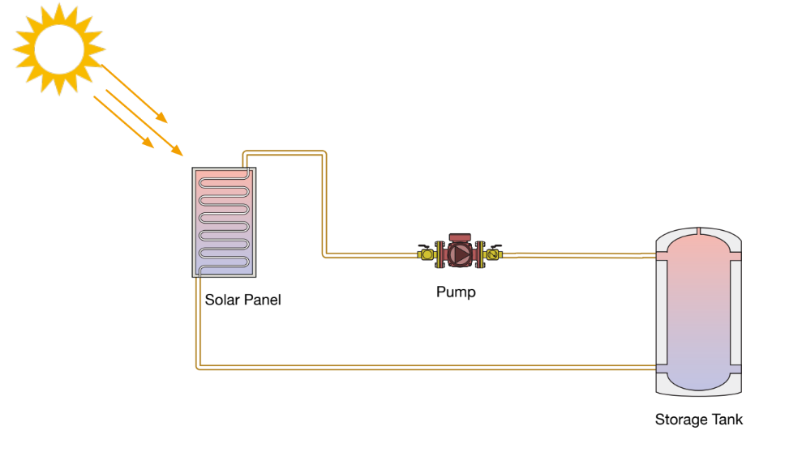

# Thermodynamics & Physics Model

The simulation's core is a simplified thermodynamic model that determines how the solar panel and water tank heat up and cool down. It balances energy coming in from the sun, energy lost to the environment, and energy moved from the panel to the tank. The model is built on four fundamental concepts.

---

### 1. Energy Input: Solar Gain ☀️

The panel absorbs energy from the sun. The amount of power it collects is determined by its efficiency, the intensity of the sunlight, and its surface area.

**Equation:**
$$Q_{in} = \eta \cdot G \cdot A$$

* $`Q_{in}`$: Power absorbed by the panel (in Watts).
* $`\eta`$ (eta): The efficiency of the panel (e.g., 0.70 for 70%).
* $`G`$: Solar Irradiance, or how strong the sun is (in W/m²).
* $`A`$: The collector area of the panel (in m²).

> **Analogy:** Think of this like catching rain in a bucket. The amount you collect ($`Q_{in}`$) depends on the size of the bucket's opening ($`A`$) and how hard it's raining ($`G`$).

---

### 2. Energy Output: Heat Loss 🌬️

Hot objects naturally lose heat to their cooler surroundings. Both the solar panel and the storage tank lose energy to the ambient air. The rate of loss depends on how well they are insulated and the temperature difference with the environment.

**Equations:**
* **Panel Loss:** $`Q_{loss,p} = U_p \cdot (T_p - T_a)`$
* **Tank Loss:** $`Q_{loss,t} = U_t \cdot (T_t - T_a)`$

* $`Q_{loss}`$: Power lost to the environment (in Watts).
* $`U`$: The heat loss coefficient (a measure of insulation; lower is better).
* $`T_p, T_t, T_a`$: The temperatures of the **p**anel, **t**ank, and **a**mbient air.

> **Analogy:** This is like a hot cup of coffee cooling down. The bigger the temperature difference between the coffee ($`T_p`$ or $`T_t`$) and the room ($`T_a`$), the faster it loses heat.

---

### 3. Energy Storage & Transfer: Temperature Change 🔥

The temperature of the panel and the tank changes based on the net energy they gain or lose. This is governed by their **thermal mass** (how much energy it takes to raise their temperature). When the pump is on, it actively transfers heat from the panel to the tank.

**Equations:**
* **Heat Transfer (Pump ON):** $`Q_{\to tank} = \dot{m} \cdot c_p \cdot \max(0, T_p - T_t)`$
* **Panel Temperature Change:** $`\dot{T}_p = (Q_{in} - Q_{loss,p} - Q_{\to tank}) / C_p`$
* **Tank Temperature Change:** $`\dot{T}_t = (Q_{\to tank} - Q_{loss,t}) / (m \cdot c_p)`$

* $`Q_{\to tank}`$: Power transferred from the panel to the tank.
* $`\dot{m}`$ (m-dot): The mass flow rate of the fluid moved by the pump (in kg/s).
* $`c_p`$: The specific heat capacity of the fluid.
* $`\dot{T}`$ (T-dot): The rate of temperature change (in °C per second).
* $`C_p`$ & $`m \cdot c_p`$: The thermal mass of the panel and the water in the tank, respectively.

> **Analogy:** This is the final accounting. If "Energy In" is greater than "Energy Out" for the panel, its temperature rises. The pump acts as a conveyor belt, moving this collected energy over to the tank.

---

### 4. Control Logic: The Smart Pump ⚙️

The pump doesn't run all the time. It uses a simple "smart" logic to ensure it only runs when it's beneficial—when the panel is significantly hotter than the tank and the tank still needs heating. This prevents the system from wasting energy or cooling the tank down.

**Rules:**
* **Pump turns ON when:** The panel is hotter than the tank by a certain amount ($`T_p \ge T_t + \Delta T_{on}`$) **AND** the tank is below its target temperature ($`T_t < \text{setpoint}`$).
* **Pump turns OFF when:** The panel is no longer hot enough ($`T_p \le T_t + \Delta T_{off}`$) **OR** the tank has reached its target temperature ($`T_t \ge \text{setpoint}`$).

> **Analogy:** The pump's rule is "Don't waste energy." It only works when the panel has useful heat to offer and the tank actually needs it.